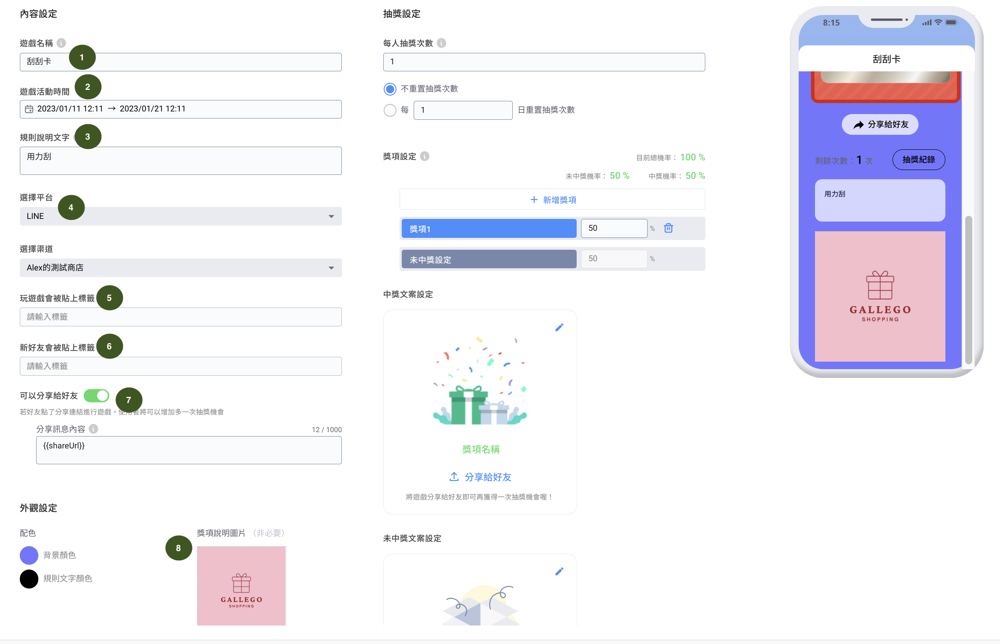

# 手氣旺旺刮刮樂

#### P.S 一旦點擊按鈕「解鎖刮刮樂」，無論有無刮開銀漆，都視為有玩過遊戲，將會留下遊玩紀錄與對應中獎內容

### 步驟一：選擇遊戲模組種類

進到『遊戲模組』按下右上角的『新增遊戲模組』，點選『手氣旺旺刮刮樂』後進到遊戲設定

### 步驟二：設定刮刮卡的內容

<figure><figcaption></figcaption></figure>


平台選擇後，只有在草稿階段的遊戲可以更改平台，遊戲發布後平台以及連結 channel 就不能修改囉


1.先設定這次的遊戲名稱：此遊戲名稱會顯示讓客人看到\
2.調整活動期間的日期跟時間

<figure><figcaption></figcaption></figure>

3\.  規則說明文字

<figure><figcaption></figcaption></figure>

4\.  選擇要進行連結的社群渠道平台。\
_**注意：如果您是選擇 LINE，請選擇當時有串接 LIFF 的 LINE 官方帳號**_

**\*遊戲開始訊息**：當您選擇在 **Facebook** 或是 **WhatsApp** 平台，可以自訂彈出遊戲訊息文字和按鈕文字

<figure><figcaption></figcaption></figure>

5\.  可以自訂或是選擇原本已經有的標籤進行設定，標籤數量沒有限制。

6\.   可以針對透過此遊戲加入的新好友，貼上標籤。

7\.  當開啟『是否分享給好友』這個功能，即當客人分享給他的好友（非好友也可以），_**其好友為未玩過遊戲且透過手機點選連結並完成遊戲時**_，即可多增加一次抽獎機會&#x20;


只有分享者會增加遊戲次數，被分享者不會增加


可以自主設定分享遊戲訊息內容，｛｛shareUrl｝｝請勿刪除，當客人分享給好友時，這串代碼會轉成遊戲的網址

<figure><figcaption></figcaption></figure>

8.獎項說明圖片：可放上獎項說明圖片

<figure><figcaption></figcaption></figure>

### 步驟三：設定玩遊戲次數及獎項設定

<figure><figcaption></figcaption></figure>

#### 1. 基本抽獎次數：每個遊戲參加者在遊戲期間，首次進入遊戲後所能抽獎的總次數

<figure><figcaption></figcaption></figure>

**可設定「每幾日」重置抽獎次數，時間一到客人將會重新獲得抽獎機會**

<figure><figcaption></figcaption></figure>

#### 2. 中獎設定

所有獎項設定的機率加總需等於 100 (包含有中獎及未中獎的獎項)

| 獎項類別 | 中獎與否 | 中獎百分比 |
| ---- | ---- | ----- |
| 未中獎  | 未中獎  | 50%   |
| 獎項1  | 有中獎  | 50%   |

1. 中獎機率可在這裡填入數字修改，會和 5. 更動功能相同
2. 可刪除該獎項
3. 獎項的名稱&#x20;
4. 此獎項獎品總數量
5. 獎項機率：中獎的機率比例。當我們設定獎項機率為 25%時，表示每個進來參加獎項的人都有 25% 的機率抽到獎項一（不論該獎品剩下幾個）

例如：今天這邊有一個抽獎箱，裡面有： 2顆 A 獎球 2顆 B 獎球 2顆 C 獎球 2顆 D 獎球 2顆未中獎球 每個玩家抽完，會把抽到的球，丟回抽獎箱，輪到下一人抽


1. 當某個獎項抽完之後 (獎項數量變為 0)，則若再有人抽中該獎項則視為未中獎！此時會彈出「未中獎訊息」
2. 支援機率小數，建議設定為小數點後兩位
3. 確保所有獎項（包含未中獎的選項機率）相加為 100% 即可！


&#x20;6\.  中獎後發送訊息：遊戲中獎後可透過設定的渠道自動發送給得獎者（**注意：LINE 需收訊息費用**）

&#x20;7\.  獎項圖片檔案為 png, jpeg, jpg，尺寸為 120 x 120 pixel


如您設定的遊戲是發佈在 LINE 渠道當領取獎品成功後，會增加提醒的視窗，提醒使用者要去 LINE 聊天室查看訊息


8\.  儲存：設定完成後需按下「儲存」

#### &#x20;未中獎設定

<figure><figcaption></figcaption></figure>

* 未中獎名稱：不用受限於名稱，如您希望參與的遊戲的人都可以有獎項，此設定亦可為「參加獎」
* 中獎機率與未中獎機率相加要等於 100%
* 可開啟是否有傳送「未中獎訊息」，如在 LINE 或 WhatsApp 上則須收取訊息費用
* 如開啟「顯示未中獎訊息」，當消費者抽中其他獎項但數量為零時，也會發送未中獎訊息。**若無設定未中獎訊息，則無需開啟「顯示未中獎訊息」**
* 未中獎亦可上傳圖片，圖片尺寸 120x 120 pixel，滑鼠移到圖片上方可點擊相機圖示來進行圖片更換

<figure><figcaption></figcaption></figure>

#### 3. 中獎文案設定

<figure><figcaption></figcaption></figure>

1. 可在這裡填入中獎訊息
2. 可在這裡填入獎項名稱
3. 可在這裡填入領取獎項的按鈕名稱

#### 4. 未中獎文案設定

<figure><figcaption></figcaption></figure>

1. 可在這裡填入未中獎訊息
2. 可在這裡填入未中獎的獎項名稱

#### 5. 抽獎紀錄：如當下未領取的消費者可再次進入到遊戲畫面查看並領取

### 步驟四：設計刮刮樂外觀

1. 配色
   * 背景顏色
   * 規則文字顏色
2. 背景圖片：寬為 1024 pixel，高度不限，高度越高會延伸成為遊戲背景
3. 刮刮卡圖片尺寸：480 x 745 pixel
4. 刮刮卡銀漆圖片尺寸：438 x 350 pixel
5. 獎項說明（非必要）：可自行上傳獎項列表圖片，呈現獎項增加遊戲吸引力。圖片尺寸：寬度須為 750 pixel，長度不限&#x20;

### 步驟五：儲存遊戲模組

儲存遊戲模組會將遊戲進到草稿階段


1. 在『草稿階段』可進行測試，但測試紀錄會在正式發佈後被清除，所以當準備正式開始發送遊戲時，請按下按鈕『發布遊戲模組』。
2. 『刪除』功能僅能在『草稿』階段進行，『進行中』及『已結束』階段的遊戲無法刪除。
3. 發佈後的遊戲如果按下暫停後再進行發佈，之前的遊玩的資料也會被清除，請務必注意！


####

#### 選擇 Facebook 平台，客人點擊遊戲連結，或掃 QR code 時，消費者**在 Messenger 收到開始遊戲卡片** **並點擊按鈕**

#### 選擇 **WhatsApp** 平台，客人點擊遊戲連結，或掃 QR code 時，消費者**在** Whatsapp 送出預設訊息後會收到遊戲連結卡片，點擊遊戲連結進入遊戲頁面

