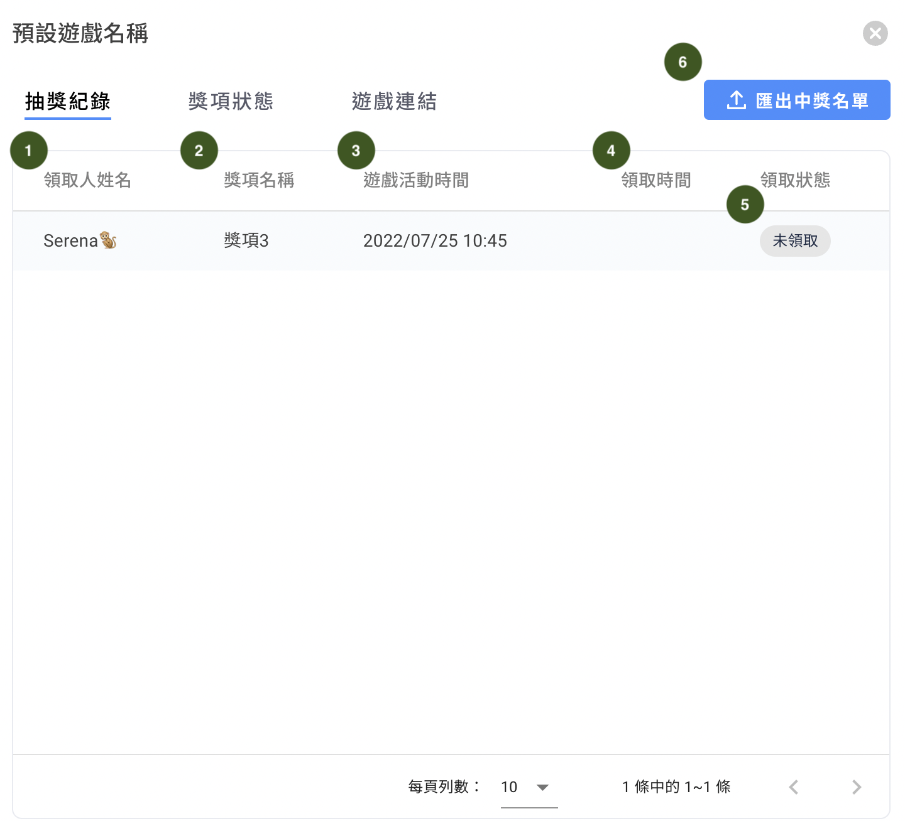

# 遊戲列表

<figure><figcaption></figcaption></figure>

1. 搜尋：可利用關鍵字搜尋遊戲活動
2. 遊戲名稱：會顯示於前台讓消費者看到
3. 有效期間：遊戲進行的期間
4. 平台：該遊戲可以使用的社群管道
5. 遊戲的類型
6. 遊戲次數：顯示參與總人次（e.g. 如 May 玩了3次，會顯示 3）
7. &#x20;新好友數：從遊戲連結進入遊玩後，才成為該社群平台的聯絡人
8. 參與人數：顯示參與總人數（e.g. 如 May 玩了3次，會顯示 1）
9. 中獎人次：顯示中獎總人次（e.g. 如 May 中了獎3次，會顯示 3）
10. 分享次數：顯示分享總次數（e.g. 如 May 分享10次，會顯示 10）
11. 遊戲目前的狀態：分為『草稿』、『進行中』和『已結束』
12. 動作
    * 編輯：可進到遊戲設定內編輯、變更
    * 遊戲資訊：查看遊戲資訊如抽獎記錄、獎項狀態和遊戲連結
    * 建立副本：可複製該遊戲模組
    * 複製遊戲連結：與從『遊戲資訊』內進入複製的遊戲連結相同
    * 刪除：刪除遊戲（_**僅在『草稿』階段才能進行刪除**_）

## 遊戲資訊

可透過該按鈕查看抽獎紀錄、獎項狀態與遊戲連結。

### 抽獎紀錄

1. 領取人姓名
2. 獎項名稱：抽、刮中獎項
3. 遊玩遊戲模組時間
4. 領取時間：點擊『立即領取』按鈕；或回到遊戲中查看遊戲紀錄按下『領取』的時間
5. 領取獎項狀態
6. 點擊『匯出中獎名單』，可以取得參與抽獎的名單。


小應用：您可以將其中獎名單匯出後，添加上標籤後匯入『聯絡人及推播訊息』名單中，即可對這群遊玩過遊戲的人進行推播和互動喔！


### 獎項狀態

### 遊戲連結

* 可以在「草稿」階段，將遊戲連結及 QR code 分享給同仁進行測試
* 下載 QR code 圖檔可應用在實體店面或活動上的文宣及看板進行宣傳及進一步跟消費者互動
* 發佈後相關應用可以參考[這裡](you-xi-mo-zu-ying-yong.md)

