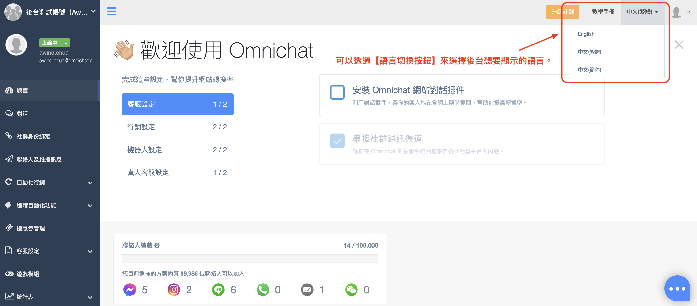

# 總覽

當您完成設定時，完成的功能會自動勾選！

## 聯絡人總數

#### 聯絡人總數：是指將各社群平台串接進 Omnichat 後台後，消費者透過品牌端各平台的官方帳號來進行互動或是加入官方帳號好友會被列入計算。

其聯絡人人數視為有效聯絡人，取消訂閱的聯絡人不會被列入計算。


新加入官方帳號好友依照不同平台有不同定義，如：LINE 是成為加入新好友、Facebook 是按下「開始使用」（「Get Started」）而 Instagram 跟 WhatsApp 是消費者直接與官方帳號進行互動。


#### 信箱符號是指當 Omnichat 後台記錄到客人的以下任一資料：E-mail、電話號碼、會員 ID時（不論是客服人員手動記錄或是 Pixel 自動抓取到），即會計算為一個有效聯絡人。

## 訊息統計圖表

* 一進到頁面預設：過去兩週的數據
* 圖表可以選取「每天」、「每週」、「每月」去做更深入的分析
  * 如果選取「每週」，兩張圖表都會顯示每週數據
* 下面兩張圖表，都可以分別點選你有串接的渠道（網頁插件、Facebook、LINE、WhatsApp）
  * 如果在「傳送訊息」圖表點選 LINE 的話，「接收訊息」的圖表渠道選項不會改變，以方邊做比較客製化分析

### 傳送訊息 ( 真人客服 | 機器人 )

* 傳送訊息有分「真人客服」跟「機器人」
* 真人客服：綠色
* 機器人：藍色

.png>)

### 接收訊息

.png>)

### 系統語言切換

可切換Omnichat系統後台顯示的語言。


1. 目前 Omnichat 後台有兩種呈現，不同頁面的調整按鈕也會有所不同。

&#x20; 2\.  所更換的系統語言，會依照「瀏覽器」去紀錄，並非根據「使用帳號」去紀錄。\
&#x20;      例如：您在 【A 瀏覽器】更換了語言，到【B 瀏覽器】仍需要自行調整語言。


<figure><figcaption>
此畫面為深色頁面，切換語言的按鈕會呈現在網頁右上方。
</figcaption></figure>

**後台呈現一：**當系統後台呈現頁面為深色頁面時，切換語言的按鈕會呈現在網頁右上方，點選【語言切換按鈕】來選擇後台想要顯示的語言即可。

<figure><figcaption></figcaption></figure>

**後台呈現二：**當系統後台呈現頁面為藍色頁面時，切換語言的按鈕會呈現在網頁左側的當前使用者資訊內，點擊後選擇【系統語言】來選擇想要顯示後台的語言即可。

