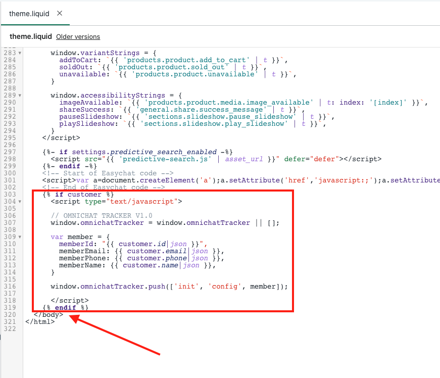

# Install Omnichat Pixel on Shopify

## Before you start

Please follow this [guideline ](../../features/tong-xun-qu-dao/wang-zhan-dui-hua-cha-jian/install/shopify.md)to install Omnichat Web chat plugin before you install the Omnichat Pixel on Shopify

## Adding the Pixel Script

1\. In Shopify, navigate to **Online Store > Themes** on the menu and click **Edit Code** under the **Actions** dropdown


2\. Edit the `theme.liquid` in **Layout**


3\. Paste the snippet below into before the `</body>` HTML tag



```javascript


  <script type="text/javascript">

  // OMNICHAT TRACKER V1.0
  window.omnichatTracker = window.omnichatTracker || [];

  var member = {
    memberId: "{{ customer.id|json }}",
    memberEmail: {{ customer.email|json }},
    memberPhone: {{ customer.phone|json }},
    memberName: {{ customer.name|json }},
  }

  window.omnichatTracker.push(['init', 'config', member]);

  </script>


```

4\. Navigate back to Shopify **Online Store > Themes** page, click **Customize**


5\. At the top of the page, click the **Home page** dropdown, and select **Products > Default product** to be brought to your default product page


6\. Click **Add section** in the left sidebar, and then select **Custom Liquid**.


7\. Paste the snippet below into the Custom Liquid text box and Click **Save**.


Check if you need to modify the below code (Line#17 & #20) to match with your theme Add to Cart button & Quantity input elements.


```javascript
<script type="text/javascript">

// OMNICHAT TRACKER V1.0
window.omnichatTracker = window.omnichatTracker || [];




var item = {
  id: "{{ product.id|json}}",
  name: {{ product.title|json}},
  price: parseFloat("{{ product.price|money_without_currency}}".replace(',', '')),
  brand: {{ product.vendor|json}},
  category: {{ categories|first|json}},
}

window.omnichatTracker.push(['event','view_product', item]);

var addToCartEls = document.getElementsByClassName("product-form__submit");

var sendAddToCartEvent = function() {
  var qty = document.getElementsByClassName('quantity__input')[0].value;
  item.quantity = qty;
  window.omnichatTracker.push(['event', 'add_to_cart', { items: [ item ] }]);
};

for (var i = 0; i < addToCartEls.length; i++) {
  addToCartEls[i].addEventListener('click', sendAddToCartEvent, false);
}

</script>
```

**Find & Update the Add to Cart button class name in Line #17**

To check the class name of the button, open up one of your site’s product pages, right-click your "Add to Cart" button, and select **Inspect**.&#x20;

The console will open, showing the source code of your "Add to Cart" button. The following image shows the class name of the "Add to Cart" button highlighted in the console. If the class name of the button on the page shown here (`product-form__submit`) is different from the variable in the default snippet. Update the snippet to match the class name on the page.


**Find & Update the Quantity input class name in Line #20**

To check the class name of the input, open up one of your site’s product pages, right-click your Quantity input, and select **Inspect**.&#x20;

The console will open, showing the source code of your Quantity input. The following image shows the class name of the Quantity input highlighted in the console. If the class name of the quantity input on the page (`quantity__input`) is different from the variable in the default snippet. Update the snippet to match the class name on the page.


8\. Navigate to Shopify > **Settings > Checkout**, Under **Order status page,** paste the snippet below into the end of the **Additional scripts** text box and Click **Save**.



**Reminder: You must install Omnichat Web Chat Plugin to make the following snippet works**


9\. Paste below snippet after Omnichat Web Chat Plugin code paste in step 8 and Click **Save**.

```javascript


<script type="text/javascript">

    // OMNICHAT TRACKER V1.0
    window.omnichatTracker = window.omnichatTracker || [];

    var member = {
    memberId: "{{ customer.id|json }}",
    memberEmail: {{ customer.email|json }},
    memberPhone: {{ customer.phone|json }},
    memberName: {{ customer.name|json }},
    }

    window.omnichatTracker.push(['init', 'config', member]);
</script>


<script type="text/javascript">
    window.omnichatTracker.push(['event','purchase', {
        "transaction_id": "{{order_number|json}}",
        "amount": parseFloat("{{ total_price|money_without_currency}}".replace(',', '')),
        "currency": {{currency|json}},
        "items": [
            
            {
                "id": "{{ line_item.product_id|json }}",
                "name": {{ line_item.title|json }},
                
                "variant": "{{line_item.variant.title}}",
                
                "quantity": {{ line_item.quantity }},
                "price": parseFloat("{{ line_item.line_price|money_without_currency}}".replace(',', ''))
            },
            

        ]
    }]);
</script>
```
